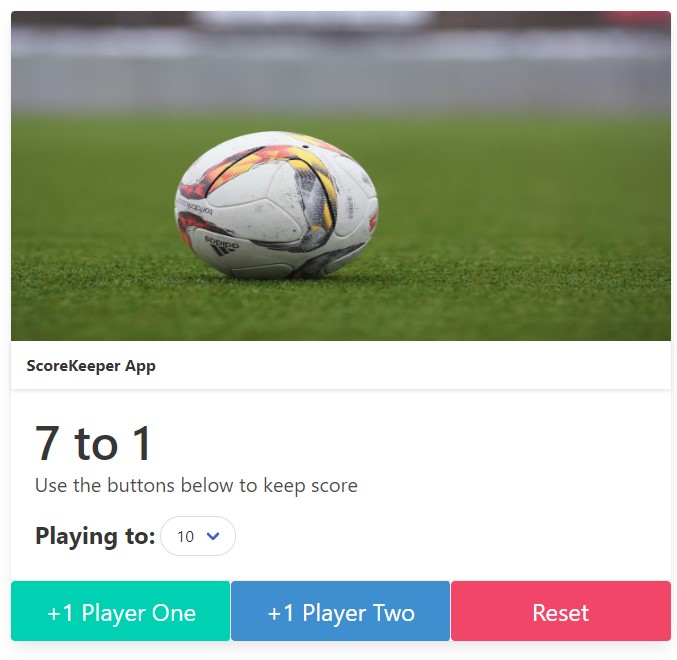

# ScoreKeeper App

## Description
A mini project designed to keep track of scores between 2 teams or players in a friendly game!

## Technologies Used
- HTML - Basic Markup and inline styling
- JavaScript - Logic and function for scorekeeping

## Examples

## Lisence
This project is under the MIT License.

